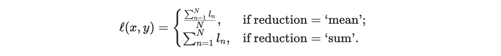

What is machine learning?
---

## How do machines learn?
<!-- pause -->
- mix of different ideas from biology, statistics, mathematics, information theory...
- let us consider the statistical view of machine learning

<!-- pause -->

## Empirical risk minimization in ML (for Hackers/Dummies)

<!-- pause -->
What we need:
- empirical data/observations
- a way to get a hypothesis **h** of the data (a prediction), let's call it a model
- a way to measure how good our hypothesis is (risk or loss)

<!-- pause -->
What we get:
- parameters of a model that minimize the risk/loss on empirical data

<!-- pause -->
### Model parameters?

To get a hypothesis/prediction of a data point, we need a function to transform data 
to a prediction.... **What is the correct function?**

<!-- pause -->
- We don't know it...
- So we build a function with many parameters that can be adjusted 
  - Note: Still, we may not be able to build every function our parameters 
- In ML we find the parameters that minimize the risk/loss on empirical data by
  following the gradient of the risk/loss function
- [universal approximation theorem](https://en.wikipedia.org/wiki/Universal_approximation_theorem)

Today, we build a ML framework that does all of this from scratch.

<!-- end_slide -->

## What we need: empirical data/observations

- We use the MNIST Dataset (handwritten digits)
- Also we don't care about the data loading for now...
- Just use some copy&pasta from the internet (already prepared)

> Try running the first code cell in the notebook and see what happens

<!-- end_slide -->

## What we need next: Way to model a hypothesis

> Remember: We don't know the correct function to transform data to a prediction

### The Multilayer Perceptron (MLP)

MLP is one of the simplest (and widely used model) models. It typically consists of:

<!-- pause -->
- a linear transformation (matrix multiplication) of the input data
<!-- pause -->
- and some (non-linear) transformation (activation function)
<!-- pause -->
- rinse and repeat (stack multiple layers)

What can we model (any?) function with that? 
- Universal approximation theorem (tbh we cannot show that)!

How long do we rinse and repeat?
- we just test what works best!
- we want the last layer to transform the output to something we can use
  - e.g. MNIST has 10 different handwritten digits, so the last layer should be
  a vector of 10

> Why did we use 10 as dimension for the last layer? Why not a single value
> that spits out numbers 0..9?

> How do we deal with 2d image data and a 1d input in a MLP?

> Go Ahead: Build a linear transformation and parameter initialization and activations
- implement files: `nn/linear.py`, `nn/fucntions.py`, `act/functions.py`

<!-- end_slide -->

## What we need next: Measure how good our hypothesis is!

Now, your model will output a vector of `(10)`. How do we measure how good our
the prediction is?

Ideas:
- the highest each entry in the vector is our prediction!
  - information theory says: bad idea because we loose information about the uncertainty 
  of our model output

Better: **Cross-Entropy** as loss function
- [Cross-Entropy](https://en.wikipedia.org/wiki/Cross-entropy)
- This wills score how certain our model predicts different digits in probabilities (0..1)

(ignore the `w_c`)

> don't feel overwhelmed by the formula. It is much easier than it looks like!

> Implement the model in the `train.ipynb` 

> Implement it in `loss/functions.py`. 

<!-- end_slide -->

## Finalizing our Training: Optimizing!

We already hinted that to find the best parameters of our model, we need to
follow the gradient of the loss function to its (hopefully) global minimum. 

Thus we can say that a parameter update is:
- `parameter = parameter - learning_rate * gradient of parameter`

with `learning_rate` being a positive step size to follow the gradient. This is
the optimization part of our training. 

But does that mean we have to calculate the first derivative of our loss
function for each parameter? 

<!-- pause -->
- technically yes!
<!-- pause -->
- BUT doing it manually would suck, we will use **automatic differentiation**!

Hence, our training looks like this:
- forward pass of some batch of data through the model (with parameters)
- calculate the cross-entropy loss
- automatically differentiate the gradient of the loss w.r.t. the parameters
- update the parameters with the update rule above 
- rinse and repeat until we are happy with the result!

> First implement the `forward()` function in the `training.ipynb`. Make use of
> our `model()` function.

> Then, implement the `forward_backward()` function in the `training.ipynb`. This
function also updates the parameters with the update rule above.  

> Finally, implement the `accuracy()` function in the `training.ipynb`. We use this to
measure how good our model is on the test data.

<!-- end_slide -->

## You made it!

That is your first ML framework. You can go from here and add more features 
from ML research to your framework. 

For example:
- more activation functions (tanh, leaky relu, sigmoid)
- more loss functions (MSE, ...)
- more update rules (Adam, RMSProp, ...) 
- more nn layers (convolutional, recurrent, ...)
- efficiency (vectorization, parallelization, GPU support, ...)

Eventually, you will have a framework that is as good as PyTorch or TensorFlow! 🎉
